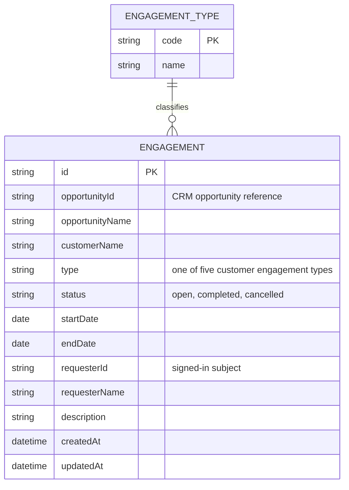

# Domain model

Customer engagements are requests raised by a requester from a CRM opportunity, typed, and moved through a simple lifecycle.

The five type names are an open question in F1; the list is held as data so it can be filled in without a contract change.