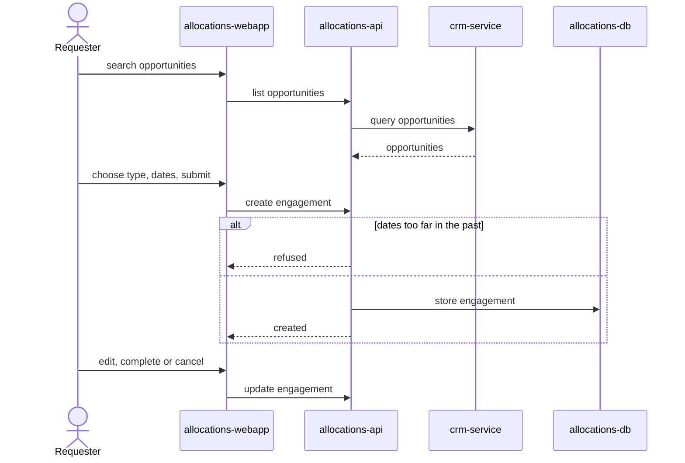

# Raise a customer engagement

A requester picks a CRM opportunity, chooses an engagement type and raises the request, then edits or completes it later.

```mermaid
sequenceDiagram
    actor Requester
    participant allocations-webapp
    participant allocations-api
    participant crm-service
    participant allocations-db

    Requester->>allocations-webapp: search opportunities
    allocations-webapp->>allocations-api: list opportunities
    allocations-api->>crm-service: query opportunities
    crm-service-->>allocations-api: opportunities
    Requester->>allocations-webapp: choose type, dates, submit
    allocations-webapp->>allocations-api: create engagement
    alt dates too far in the past
        allocations-api-->>allocations-webapp: refused
    else
        allocations-api->>allocations-db: store engagement
        allocations-api-->>allocations-webapp: created
    end
    Requester->>allocations-webapp: edit, complete or cancel
    allocations-webapp->>allocations-api: update engagement
```